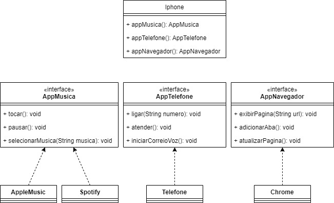

# POO - Desafio

Exercício para estudos de POO em Java que consiste na modelagem e diagramação da representação UML e Código no que se refere ao componente Iphone

Comportamentos esperados:

* Repodutor Musicial: tocar, pausar, selecionarMusica
* Aparelho Telefônico: ligar, atender, iniciarCorrerioVoz
* Navegador na Internet: exibirPagina, adicionarNovaAba, atualizarPagina

## Diagrama UML

